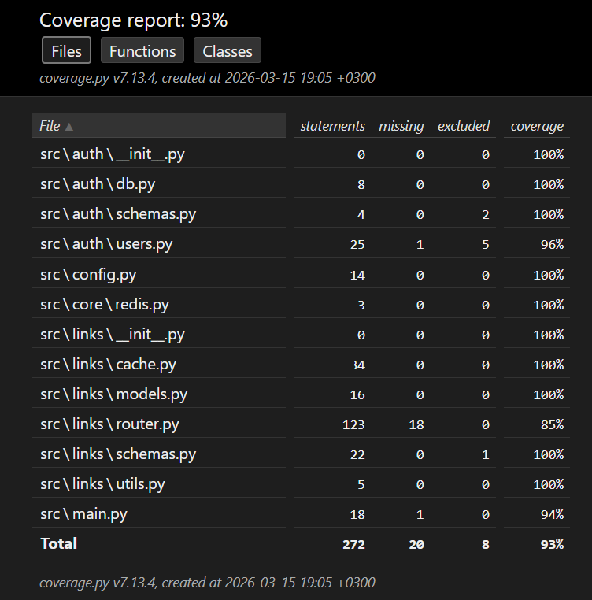
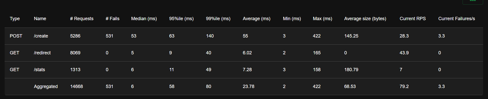
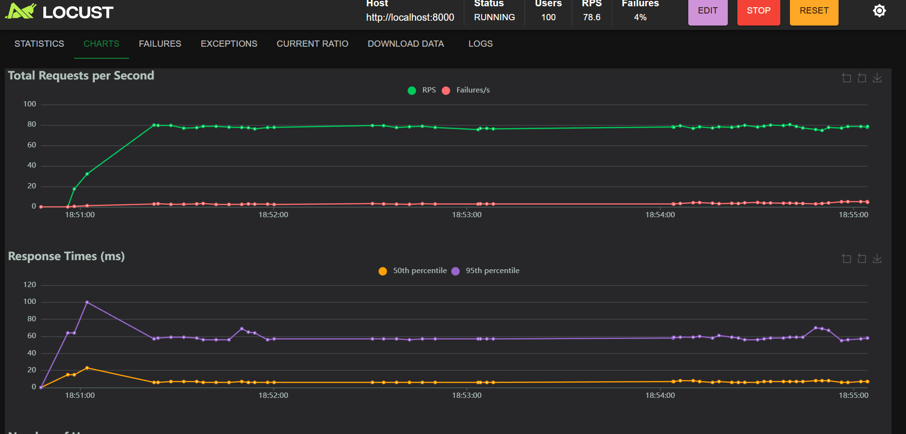

### Юнит-тесты

```bash
pytest tests/unit_tests.py -v
```

### Функциональные тесты

```bash
pytest tests/functional_test.py -v
```

### Все тесты с измерением покрытия

```bash
coverage run --source=src -m pytest tests/unit_tests.py tests/functional_test.py
coverage report
```

### Нагрузочное тестирование Locust

Создание популярных ссылок 
```bash
0..9 | ForEach-Object { $i = $_ + 100; Invoke-RestMethod -Uri "http://localhost:8000/links/shorten" -Method Post -Headers @{"Content-Type"="application/json"} -Body (@{original_url="https://example.com/$i"; custom_alias="load$i"} | ConvertTo-Json) }
```

Запуск Locust
```bash
locust -f tests/load_test.py --host=http://localhost:8000
```

### Покрытие кода
Полный HTML-отчёт покрытия доступен в папке [`htmlcov/index.html`](../htmlcov/index.html) – скачайте и откройте в браузере.  
  
*Рисунок 1. Покрытие файлов*  

### Нагрузочное тестирование
100 одновременных пользователей, spawn rate 10/сек, длительность ~5 мин.  

### Графики Locust

*Рисунок 2. Статистика запросов (таблица)*


*Рисунок 3. Графики времени ответа и RPS*
